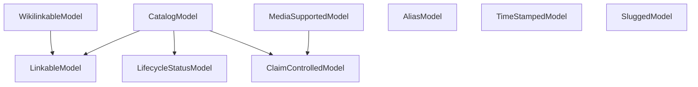

# Data Modeling

Principles and conventions for Django models in Pinbase.

## Principles

### Validate strictly

Add the strictest constraint you can defend. Relaxing a constraint is simple, but tightening can be extremely costly data migration.

### Validate in the database

Push as much validation as you can to the database. Django has multiple ORM paths that skip Python validation (`objects.create()`, `bulk_create()`, `update()`), and some writes can bypass the ORM entirely, such as our bulk ingest code, management commands, migrations, raw SQL, database tools.

### Default to PROTECT on foreign keys

`on_delete=PROTECT` blocks deletion of a referenced row. This is the safe default — it forces you to handle the dependency explicitly rather than silently losing data. Use `CASCADE` only for wholly owned children (e.g., `MediaVariant` belongs to `MediaAsset` — deleting the asset should delete its variants). Never use `SET_NULL` unless there's a clear product reason to preserve the row without its parent.

### Know which uniqueness guarantees are DB-enforced vs app-enforced

Not every "no duplicates" rule lives in the DB. When a rule needs normalization the DB can't easily express (case-insensitive, article-stripped, punctuation-folded), it lives at the application layer. The split is meaningful:

- **DB-enforced** (e.g., `Title.slug`, `MachineModel.slug`): a unique constraint. The DB raises `IntegrityError` on violation. No TOCTOU race is possible — the constraint is atomic with the insert.
- **App-enforced** (e.g., `Title.name` normalized): a query-then-insert pattern. There is a race window between the query and the insert where two concurrent writers can both pass the check. The correctness floor is the DB constraint (when one exists) or the acceptance that rare races produce near-duplicates that have to be cleaned up editorially.

When adding an app-enforced uniqueness rule:

1. Document the normalization rule in a colocated module (see [backend/apps/catalog/naming.py](../backend/apps/catalog/naming.py) as the template).
2. Enforce at the API layer, not only the UI. A UI gate is ergonomic; the API check is the invariant.
3. State the race behavior in the endpoint's docstring so future readers know what isn't guaranteed.
4. Prefer a stricter check over a looser one, since relaxing is a one-line change and tightening requires auditing existing rows.

## Abstract base classes

We use abstract base classes (mixins) to isolate each separate system concern. For example, the wiki linking system only knows about WikilinkableModels; it doesn't have to know about any model info other than that.



- `CatalogModel`: the basic contract for a catalog entity: URL-addressability, claims control, and soft-delete support.
- `MediaSupportedModel`: opt-in for entity media attachments; requires the model to be claim-controlled because media attachments are claims.
- `WikilinkableModel`: opt-in for markdown wikilink autocomplete; requires the model to also be URL-addressable.
- `AliasModel`: shared behavior for alias rows; aliases are claim values on the parent entity, not claim-controlled entities themselves.
- `SluggedModel`: globally unique slug field for entities whose slug is their public identity.
- `LinkableModel`, `LifecycleStatusModel`, and `ClaimControlledModel`: narrower capability bases used directly by higher-level catalog mixins and other concrete models.
- `TimeStampedModel`: created/updated bookkeeping timestamps.

## Conventions

### GenericForeignKey

Use `PositiveBigIntegerField` for `object_id` to match `BigAutoField` PKs. Use `on_delete=PROTECT` on the `ContentType` FK.

### Constraint naming

Use explicit names: `{app}_{model}_{description}`. Never rely on Django's auto-generated names.

Cross-field constraints use `violation_error_code="cross_field"`.

### Range and enum constants

Define range bounds and enum values as module-level constants. Reference them from both validators and constraints so they can't drift apart. See `test_constraint_drift.py` for the meta-test that enforces this.

### Storage keys

Store relative paths, never full URLs. The storage prefix (e.g., `media/`) is enforced in application code, not DB constraints, so the storage location stays configurable without schema changes.

### No regex in CHECK constraints

`__startswith`, `__contains`, and `__endswith` generate standard SQL `LIKE`, which works identically on PostgreSQL and SQLite. Use these in CHECK constraints.

**Do not use `__regex` in CHECK constraints.** On SQLite, `__regex` generates `REGEXP`, which depends on a Python function that Django registers on the connection. It works during normal Django operations, but anything that touches the database outside Django (DB browsers, backup restores, raw migration scripts) won't have the function — causing "no such function: regexp" errors or silently unenforced constraints.

If a pattern can't be expressed with LIKE, enforce it in Django model validation instead of a CHECK constraint.

## Testing DB Constraints

Use `objects.create()` with `pytest.raises(IntegrityError)`. Django's `create()` bypasses `full_clean()`, so invalid values hit the DB constraint directly. No raw SQL or `_raw_update` helper needed.

Test both directions:

- **Negative**: invalid data is rejected (the constraint fires).
- **Positive**: valid edge cases are accepted (the constraint doesn't over-reject).

```python
def test_byte_size_zero_rejected(self, user):
    with pytest.raises(IntegrityError):
        MediaAsset.objects.create(**_asset_kwargs(user, byte_size=0))

def test_valid_asset_without_dimensions(self, user):
    """Non-ready assets can omit dimensions."""
    asset = MediaAsset.objects.create(
        **_asset_kwargs(user, status="failed", width=None, height=None)
    )
    assert asset.pk is not None
```
